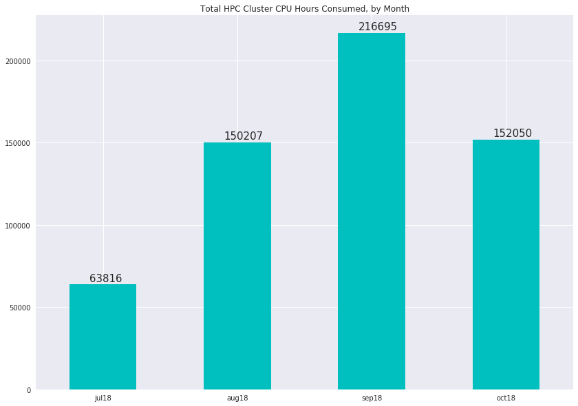
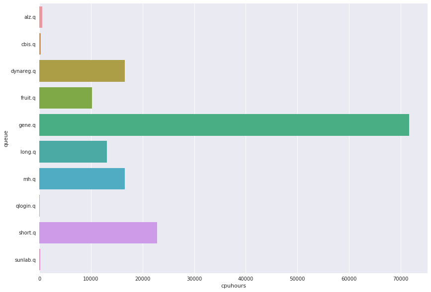

# HPC Cluster Status
####  CDAG Meeting, November 12 2018

### Consumed CPU hours, Aggregate by Month

### Usage by User Queue, Hours for Month of October

Queue | CPU Hours
---------:|:-----
alz.q|581
cbis.q|251
dynareg.q|16596
fruit.q|10157
gene.q|71683
long.q|13108
mh.q|16574
qlogin.q|82
short.q|22812
sunlab.q|205

### Top 5 Accounts for Cluster Usage, October
##### (Number of users: 45, mean usage: 3378 wall clock hours)

Owner | Wallclock
:--------|:------
bwei8|65070
zzhu56|38328
yhu245|22862
yhu30|10584
cchan40|8653
