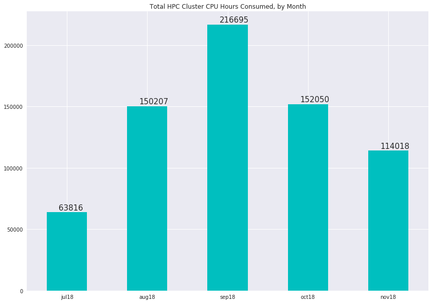
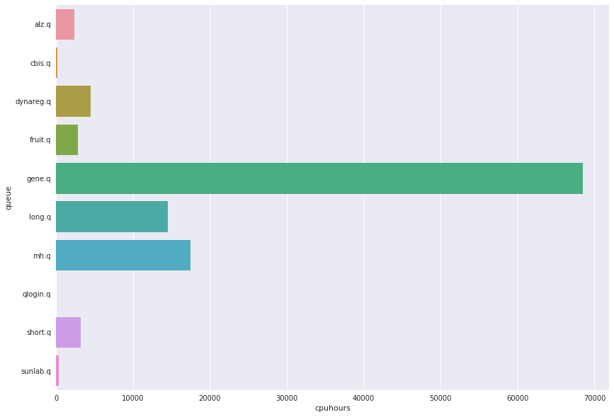

# HPC Cluster Usage Statistics
####  CDAG Meeting, December 10 2018

### Consumed CPU hours, Aggregate by Month

### Usage by User Queue, Hours for Month of November

Queue | CPU Hours | CPU hour prev
---------:|:-----------|:------------
alz.q|2336|581
cbis.q|207|251
dynareg.q|4499|16596
fruit.q|2852|10157
gene.q|68502|71683
long.q|14552|13108
mh.q|17489|16574
qlogin.q|20|82
short.q|3178|22812
sunlab.q|378|205

### Top 10 Accounts for Cluster Usage, November
##### (Number of users: 46, mean usage: 2425 wall clock hours)

Wallclock | Owner
:--------|:--------
46044.4|yhu245
16502.3|bwei8
14701.7|zzhu56
8087.91|bwu30
8059.83|hma30
4683.86|yli298
3777.29|yhu30
3573.33|ksu22
3143.76|emin6
2127.69|tfei
