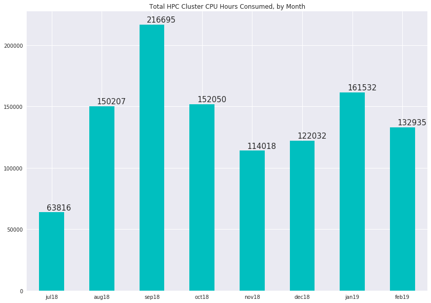

# HPC Cluster Usage Statistics
####  CDAG Meeting, March 11, 2019

### Consumed CPU hours, Aggregate by Month

### Usage by User Queue, Hours for Month of February

Queue | CPU Hours
---------:|:-----------
alz.q|803.37
cbis.q|473.311
dynareg.q|4178.04
fruit.q|25.7494
gene.q|100150
long.q|8079.23
mh.q|11139.4
qlogin.q|314.771
short.q|6828.77
sunlab.q|941.477

### Top 10 Accounts for Cluster Usage, February 2019
##### (Number of users: 51, mean usage: 2556 wall clock hours)

Wallclock | Owner
:--------|:--------
66983.2|alane7
18238.2|yhu245
14759.3|bwei8
11237.9|yli298
5113.77|zzhu56
3795.19|yhua229
2102.71|mksteel
1958.06|hfeng5
1655.15|jsoh6
1150.71|yzha843
