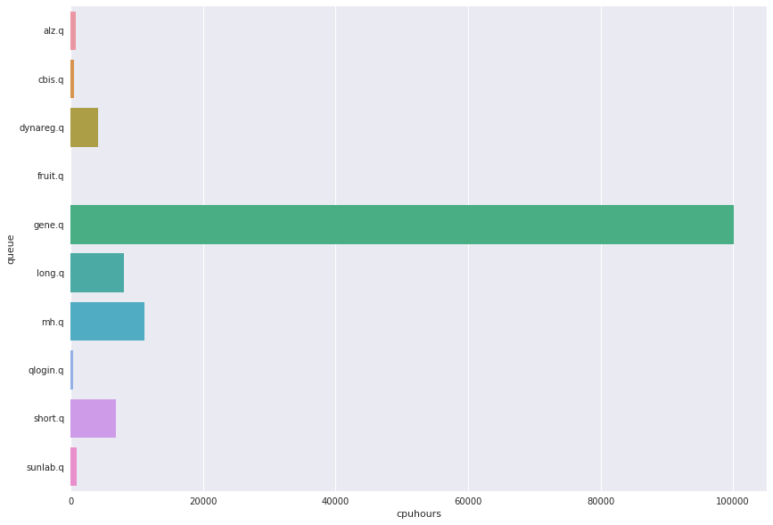

# HPC Cluster Usage Statistics
####  CDAG Meeting, March 11, 2019

### Consumed CPU hours, Aggregate by Month

### Usage by User Queue, Hours for Month of December

Queue | CPU Hours | CPUhr Nov | CPUhr Oct
---------:|:-----------|:------------|:------------
alz.q|201|2336|581
cbis.q|1344|207|251
dynareg.q|8009|4499|16596
fruit.q|1|2852|10157
gene.q|74386|68502|71683
long.q|10175|14552|13108
mh.q|16883|17489|16574
qlogin.q|56|20|82
short.q|10580|3178|22812
sunlab.q|394|378|205

### Top 10 Accounts for Cluster Usage, December
##### (Number of users: 41, mean usage: 2905 wall clock hours)

Wallclock | Owner
:--------|:--------
48898.5|zzhu56
38702.2|bwei8
22155.5|yhu245
2877.4|yli298
1660.54|ihiggin
1648.56|alane7
1329.15|jlukemi
1282.23|lche283
798.104|yhu30
473.516|yhua295

