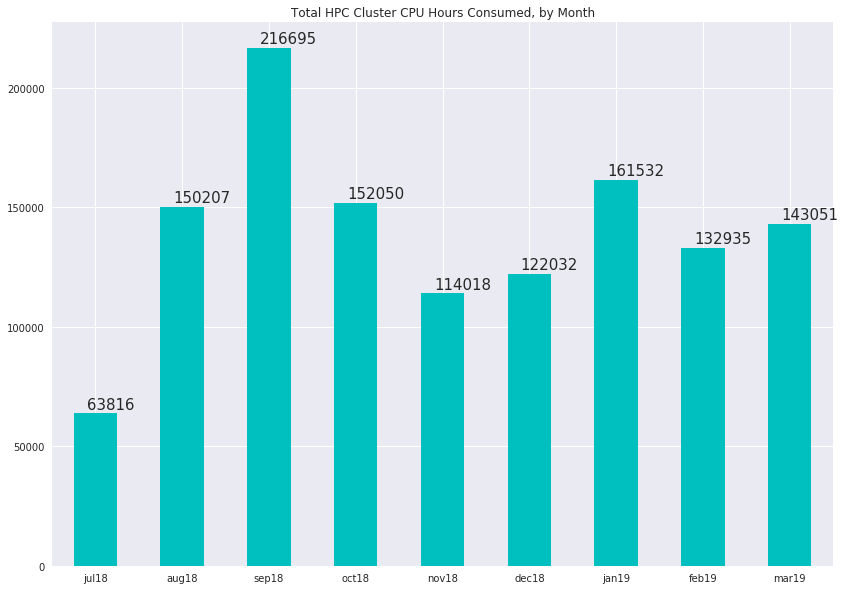
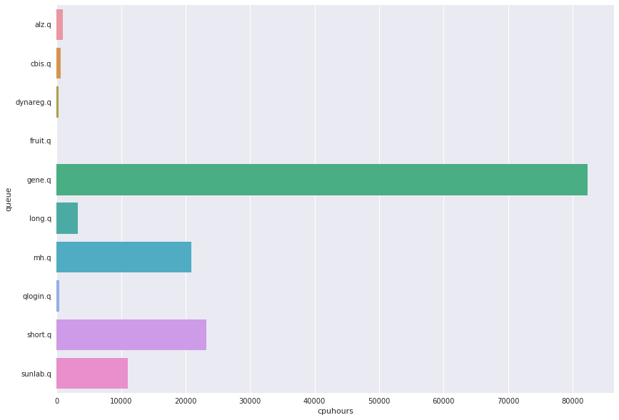

# HPC Cluster Usage Statistics
####  CDAG Meeting, April 8, 2019

### Consumed CPU hours, Aggregate by Month

### Usage by User Queue, Hours for Month of March

Queue | CPU Hours
---------:|-----------:
alz.q|803
cbis.q|473
dynareg.q|4178
fruit.q|25
gene.q|100150
long.q|8079
mh.q|11139
qlogin.q|314
short.q|6828
sunlab.q|941

### Top 10 Accounts for Cluster Usage, March 2019
##### (Number of users: 49, mean usage: 2805 wall clock hours)

Wallclock | Owner
:--------|:--------
41847.4|alane7
30747.5|yhua229
23777.1|yhu245
21264.4|bwei8
7889.71|yli298
6777.89|zzhu56
2697.38|yhu30
2679.49|xxue8
696.084|yxiao69
621.776|tfei
