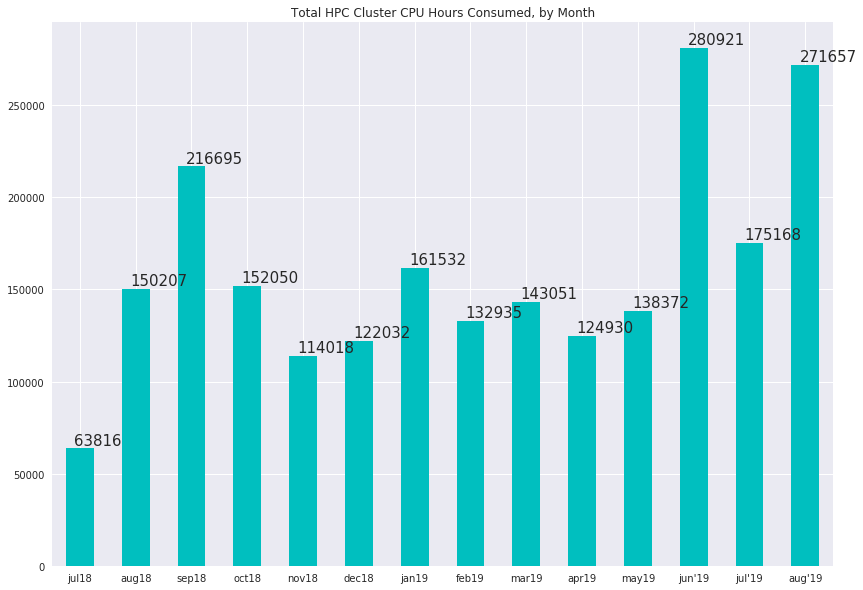
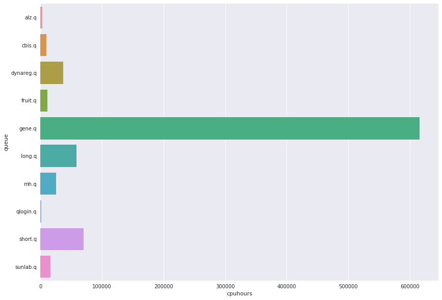

# HPC Cluster Usage Statistics
####  CDAG Meeting, September 9, 2019

### 2018-2019 Consumed CPU hours, Aggregate by Month

### Usage by User Queue, Hours for Summer 2019

Queue | CPU Hours 
---------:|-----------:
alz.q|2895.79
cbis.q|9988.33
dynareg.q|37365.7
fruit.q|11059.7
gene.q|615837
long.q|58699.7
mh.q|25565.9
qlogin.q|1793.91
short.q|70025.7
sunlab.q|16067.6

### Top 10 Accounts for Cluster Usage, April 2019
##### (Number of users: 53, mean usage: 2271 wall clock hours)

Wallclock | Owner
:--------|:--------
52415.3|bwei8
21027.9|yli298
20295.1|yhua229
14817.4|yhu245
4493.87|xxue8
2290.98|bwu30
1429.02|wwan322
1398.36|xma72
1382.41|alane7
1137.98|lwang99
