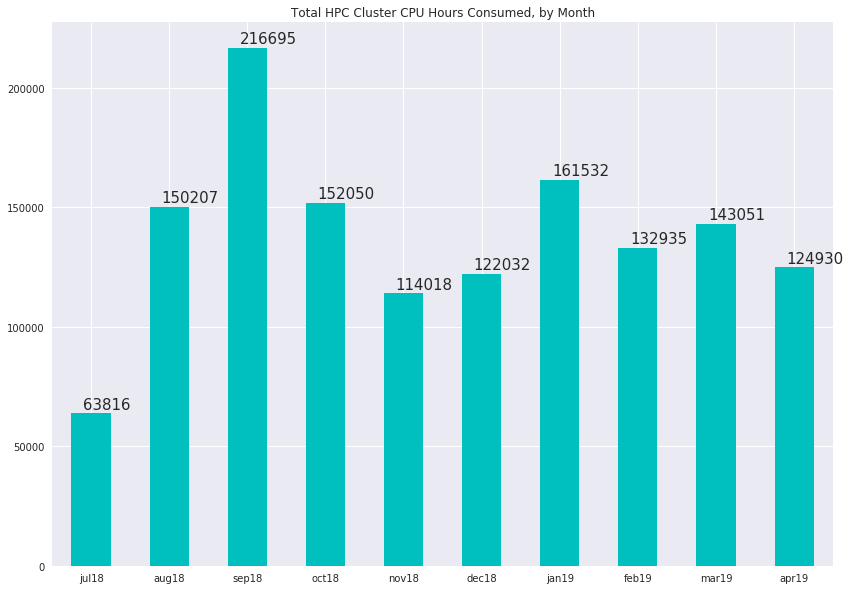
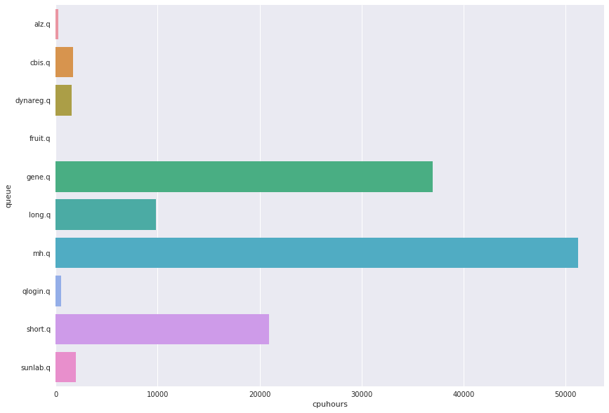

# HPC Cluster Usage Statistics
####  CDAG Meeting, September 9, 2019

### Consumed CPU hours, Aggregate by Month

### Usage by User Queue, Hours for Month of April

Queue | CPU Hours | Previous
---------:|-----------:|-----------:
alz.q|272|979
cbis.q|1680|680
dynareg.q|1553|265
fruit.q|6|1
gene.q|36948|82329
long.q|9804|3259
mh.q|51244|20896
qlogin.q|515|465
short.q|20953|23182
sunlab.q|1950|10993

### Top 10 Accounts for Cluster Usage, April 2019
##### (Number of users: 53, mean usage: 2271 wall clock hours)

Wallclock | Owner
:--------|:--------
52415.3|bwei8
21027.9|yli298
20295.1|yhua229
14817.4|yhu245
4493.87|xxue8
2290.98|bwu30
1429.02|wwan322
1398.36|xma72
1382.41|alane7
1137.98|lwang99
