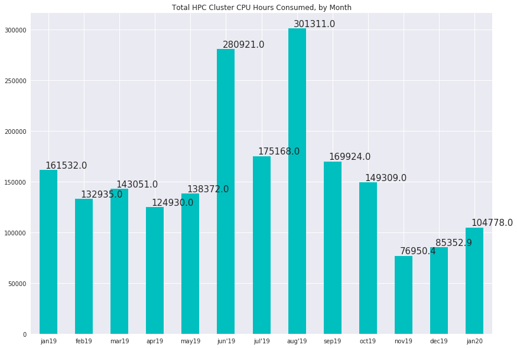
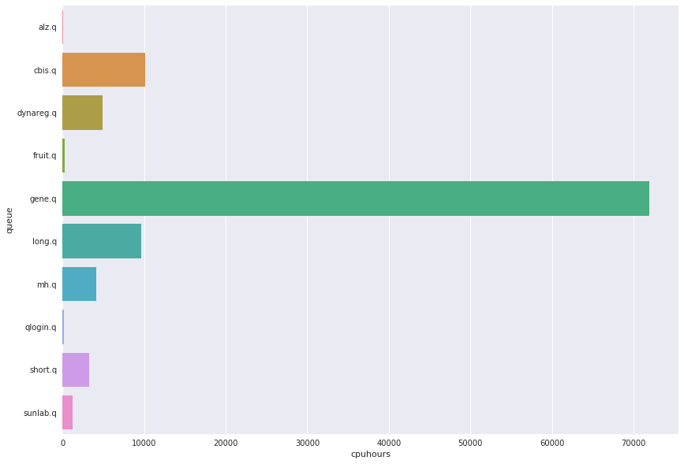

# HPC Cluster Usage Statistics
####  CDAG Meeting, February 10, 2020

### Consumed CPU hours, Aggregate by Month

### Usage by User Queue, Hours for Month of April

Queue | CPU Hours | Previous
---------:|-----------:|-----------:
alz.q|53
cbis.q|10108
dynareg.q|4913
fruit.q|265
gene.q|71946
long.q|9637
mh.q|4151
qlogin.q|181
short.q|3277
sunlab.q|1226

### Top 10 Accounts for Cluster Usage, January 2020
##### (Number of users: 36, mean usage: 2938 wall clock hours)

Wallclock | Owner
:--------|:--------
34966.2|yhu245
34630.5|alane7
12118.1|ycui38
5353.28|rmurden
4768.43|jlukemi
4150.52|hma30
2819.11|yhu30
1846.4|swan542
1057.79|mksteel
917.801|zwu56

