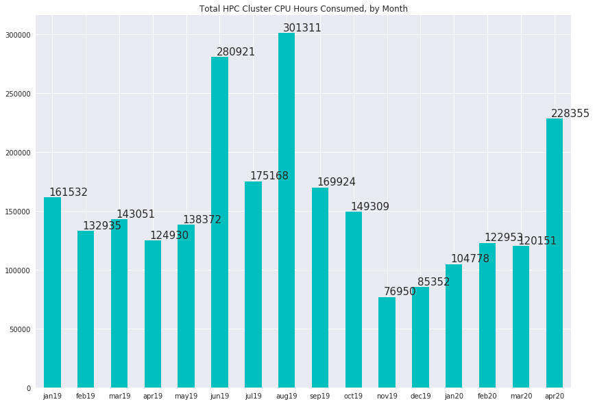
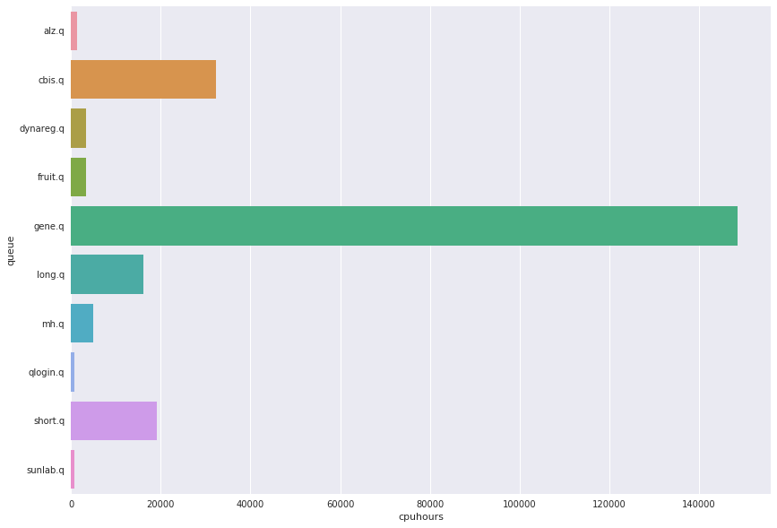

# HPC Cluster Usage Statistics
####  CDAG Meeting, May 11, 2020

### Consumed CPU hours, Aggregate by Month

### Usage by User Queue, Hours for Month of April

Queue | CPU Hours
---------:|-----------:|
alz.q|1298.11
cbis.q|32337.9
dynareg.q|3450.57
fruit.q|3300.81
gene.q|148614
long.q|16096.3
mh.q|4968.03
qlogin.q|836.17
short.q|19040.4
sunlab.q|749.277

### Top 10 Accounts for Cluster Usage, April 2020
##### (Number of users: 44, mean usage: 5189 wall clock hours)

Wallclock | Owner
:--------|:--------
34966.2|yhu245
34630.5|alane7
12118.1|ycui38
5353.28|rmurden
4768.43|jlukemi
4150.52|hma30
2819.11|yhu30
1846.4|swan542
1057.79|mksteel
917.801|zwu56
