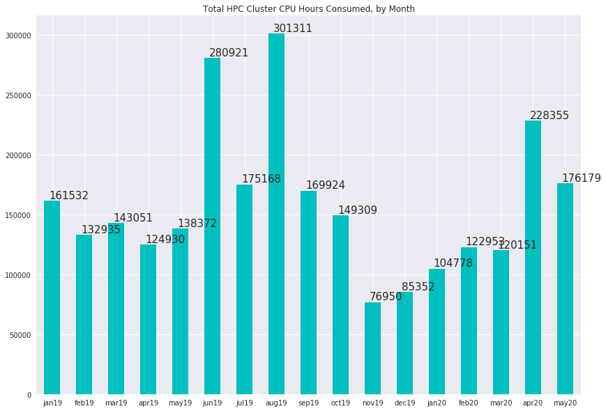
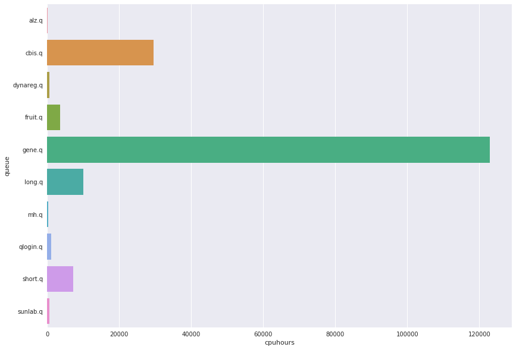

# HPC Cluster Usage Statistics
####  CDAG Meeting, June 9, 2020

### Consumed CPU hours, Aggregate by Month

### Usage by User Queue, Hours for Month of May

Queue | CPU Hours
---------:|:-----------|
alz.q|67.7256
cbis.q|29615.7
dynareg.q|647.002
fruit.q|3586.93
gene.q|122950
long.q|10111.1
mh.q|217.9
qlogin.q|1147.16
short.q|7190.97
sunlab.q|645.101

### Top 10 Accounts for Cluster Usage, May 2020
##### (Number of users: 41, mean usage: 4297 wall clock hours)

Wallclock | Owner
:--------|:--------
73715|zzhu56
44177.6|yli298
18460.8|xma72
11256.9|jlukemi
5811.83|yhu245
5581.12|zli87
4558.64|esajews
3593.57|emin6
2480.56|yjin85
1297.29|lge24

